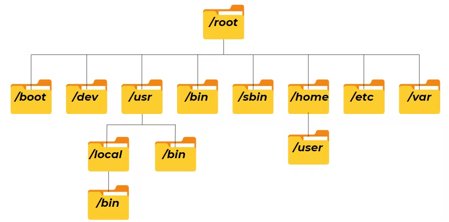

# Networking Fundamentals
## Basic Networking Terms
### Network: 
A computer network is a digital telecommunications network for sharing resources between nodes(computing devices) that use common telecommunication technology.

### Network Interface Controller (NIC):
It is the card in computers and laptops which has **MAC Address**, using which communication happens

### MAC Address:
A media access control address is a unique identifier assigned to a network interface controller for use as a network address in communications within a network segment. This use is common in most IEEE 802 networking technologies, including Ethernet, Wi-Fi, and Bluetooth.

MAC Address Burned Reference stored in Hardware's read-only memory by firmware mechanism. So that the original MAC Address stays with the hardware.

### Data Transmission:
Electrical signals were used as mode of transmission and cables were the means of transmission.

Different types of cables from 10Base5, 10Base2, UTP (Unshielded Twisted Pair), Fiber cables (single mode, multimode) are used based on the devices and their interfaces.

### Client and Server:
<dl>
  <dt>Server</dt>
  <dd>It is a program or device that provides functionality for other programs or devices (clients).</dd>
  <dt>Client</dt>
  <dd>It is a piece of computer or software that accesses a service which is made avaialble by a server. </dd>
</dl>

### Protocol:
Set of rules on which communication happens is defined as protocol.

For Example: English language acts as protocol between me (typing this text) and you (reading the text).

### Port:
+ It is the communication endpoint.
+ It is a 16 bit unsigned integer from `1` to `65535`
+ Few Predefined ports are:
	+ HTTP - 80
	+ HTTPS - 443
	+ FTP - 20

### DHCP:
DHCP is a network management protocol used on IP networks where a DHCP server dynamically assignas an IP address and other network configuration parameters to each device connected to a network so they can communicate with other IP networks.

In absence of DHCP server, a computer needs to be manually assigned an IP address or it can use a special local link IP address to allow communication on the local network.

### Attenuation: 
Reduction in strength or intensity of the signal as it's transmission distance increases.

## Network Devices:
### Repeater:
+ Repeats the signal from one port to another port.
+ It amplifies the signal strength without analysing the data in signal.
+ It has only `2` ports and a power source.
+ There exists a special type of repeater which has more than `2` ports, it is called as **Hub**.
+ It is a Layer 1 device (Physical Layer).


### Hub:
+ It acts just like repeater, but with multiple ports.
+ Repeats signal to all other ports without understanding the signal.
+ Usually has 24 ports.
+ Wi-Fi is a hub in air.

### Switch:
+ Switch has intelligence, unlike Hub.
+ It uses a **MAC Address Table** and sends **Frames** to only where it has to be sent.
+ Number of ports may vary depending on manufacturer and product.
+ It is mainly used in **Local Area Network**
+ It is a Layer 2 device (Data Link Layer).

### Bridge:
+ Bridge acts a intermediate between Switch and Hub.
+ Also a Layer 2 device.

### Routers:
+ Allows us to route from one network to another network.
+ It is used to connect LAN's to Internet (WAN).

### Firewall:
+ Based on the rules defined, inbound and outbound traffic can be regulated.
+ It acts as a switch in network, monitoring the traffic.

### Access Points:
+ They are used to manage multiple devices connected to WAN Controller.
#### IDS (Intrusion Detection System):
+ It detects and alerts if any unwanted traffic is trying to enter a network
+ Just like Alarm, just detects the intruder.

#### IPS (Intrusion Prevention System):
+ It detects and prevents the unwanted traffic entering the network.
+ Offers better security than IDS.

# Linux
## Common Terms and Concepts:
### The Shell:
`shell`  is an environment and interpreter for running commands  
in Linux. it is a program that takes commands from user who is in user mode from keyboard using stdin, and sends them to operating system to perform actions depending on user input which has predefined functioning.

`bash` (Bourne Again Shell) is one of the most used shell, there are others like ksh, zsh(in macOS), tsch.

### Binaries:
+ These are the files than can be executed, similar to `.exe` files in windows.
+ They usually reside in `/usr/bin` or `/usr/sbin` .
+ The binaries include common utilities like `ps`, `cat`, `cd`.

```bash
Unlike Windows, Linux is case sensitive. ps != Ps
```

### Directory: 
Same as folders in windows. provides a way of organizing files in hard disk or SSD in hierarchical manner.

### root:
+ Super user who has complete control over the system. Be it from adding users to crashing the system (```sudo -rm -rf```)


## The Linux File System

+ `/` :  root of the file system.
+ `/bin` : Directory for Binaries, commands such as `ls`, `ps` are stored here.
+ `/sbin` : Super User Binaries.
	+ Can be executed only by root users.
	+ Like `mount`, `adduser`, `deluser`. 
+ `/lib` : Libraries
	+ contains essential libraries and kernel modules.
	+ also contains shared library images which are used to boot the system and run commands in root filesystem.
	+ Similar to windows DLL's
+   `/boot` - Contains kernel boot loader files.
-   `/dev` - Device files.
-   `/etc` - Core system configuration directory, should hold only configuration files and not any binaries.
-   `/home` - Personal directories for users, holds your documents, files, settings, etc.
-   `/media` - Used as an attachment point for removable media like USB drives.
-   `/mnt` - Temporarily mounted filesystems.
-   `/opt` - Optional application software packages.
-   `/proc` - Information about currently running processes.
-   `/root `- The root user's home directory.
-   `/run` - Information about the running system since the last boot.
-   `/srv` - Site-specific data which are served by the system.
-   `/tmp` - Storage for temporary files
-   `/usr` - This is unfortunately named, most often it does not contain user files in the sense of a home folder. This is meant for user installed software and utilities, however that is not to say you can't add personal directories in there. Inside this directory are sub-directories for /usr/bin, /usr/local, etc.
-   `/var` - Variable directory, it's used for system logging, user tracking, caches, etc. Basically anything that is subject to change all the time.

## Common Linux  Commands:
### `pwd`: 
+ Everything is a file in Linux and every file is organized in a hierarchial directory tree.
+ `pwd` prints the current working directory.
+ ![[images/pwd.png]]

### `whoami`:
+ Current logged in user name.
+ ![[images/whoami.png]]

### `cd`:
+ Change directory is used to move around the directories.
+ There always exists two hidden files in every directory, they are `./.` & `./..`
+ `.` refers to the current directory

### `ls`:
+ list files and directories.
+ check for --help or man page to see the arguments that can be used.
+ -a -> to list all files and directories (including hidden one's)
+ -l -> long listing of all files and directories with user, group and other permissions. file size in bytes and owner.
+ ![[images/ls-l.png]]

### `touch`:
+ It is used to change the timestamp of a file or to create a new file.
![[images/touch.png]]

### `file`:
+ It is used to show the file fomat of a file.
+ There can be a file `laughing.gif` which isn't actually a gif file.
+ `file` shows description of file's contents.
+ ![[images/file.png]]

### `cat`:
+ stands for concatenate, it is used to read the contents of the file.
+ not great for viewing large content files.
+ ![[images/cat.png]]

### `less` & `more`:
+ to view large contents in a fixed screen width, one after another, less is used.
+ On contrary to `less`, `more` is used.

### `history`:
+ It is a history of the commands that you previously entered in the shell.
### `cp`
### `mv`
### `rm`
### `mkdir`
### `rmdir`
### `find`
### `locate`
### `help`
### `man`
### `whatis`
### `whereis`
### `which`
### `alias`
### `exit`
### `grep`
### `ps`


